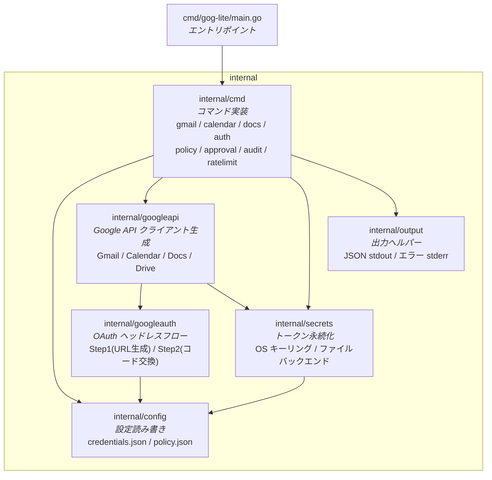
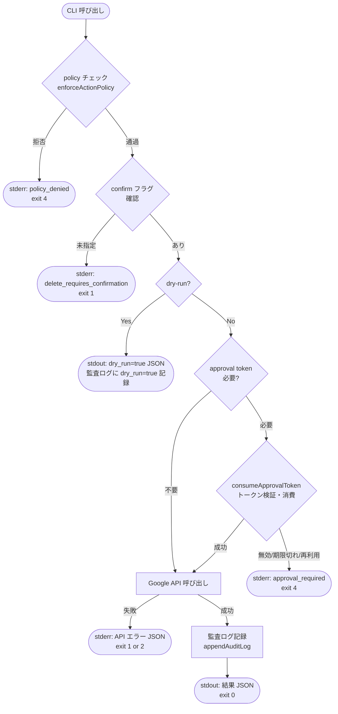
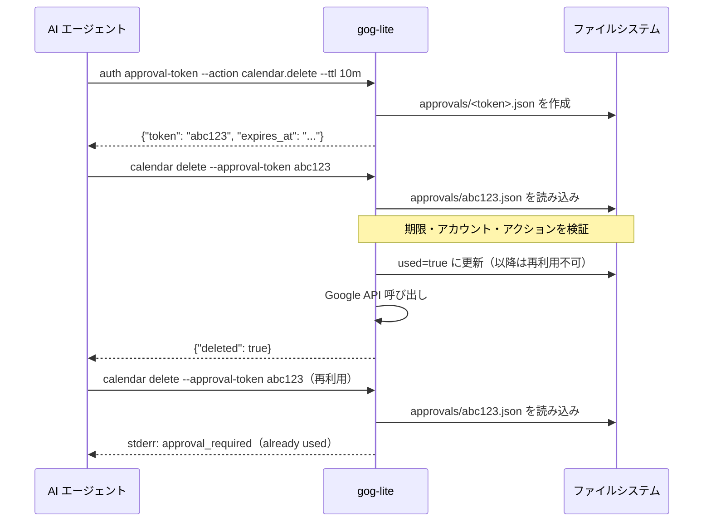
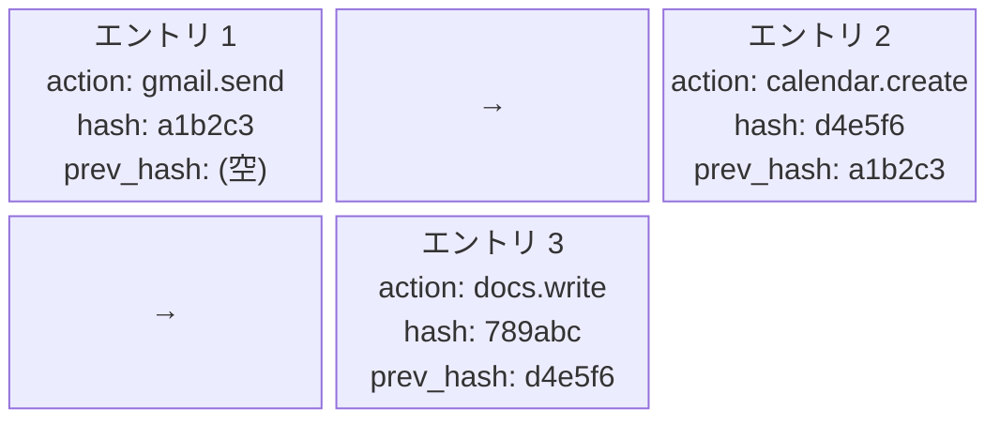
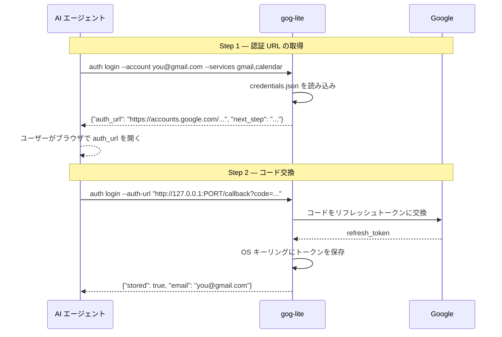

# Architecture

gog-lite は AI エージェントが安全に Google API を操作するための CLI ツールです。
このドキュメントでは内部構造・データフロー・セキュリティ設計を説明します。

---

## パッケージ構成



---

## 書き込みコマンドのリクエストフロー

読み取りコマンド（`gmail search` など）はシンプルに API を呼ぶだけですが、
書き込みコマンドは以下の多段チェックを通過します。



> **confirm フラグが必要なコマンド**：`calendar delete` → `--confirm-delete`、`docs write --replace` → `--confirm-replace`、`docs find-replace` → `--confirm-find-replace`

---

## セキュリティレイヤー

### 1. ポリシー制御（`internal/cmd/policy.go`）

`~/.config/gog-lite/policy.json` でアクションとアカウントを制限します。

```json
{
  "allowed_actions": ["gmail.search", "calendar.get", "gmail.send"],
  "blocked_accounts": ["untrusted@example.com"],
  "require_approval_actions": ["calendar.delete", "docs.write.replace"]
}
```

- `allowed_actions` が空の場合はすべてのアクションを許可（デフォルト動作）
- `require_approval_actions` が空の場合はデフォルトセット（`calendar.delete`、`docs.write.replace`、`docs.find_replace`）を使用

### 2. 承認トークン（`internal/cmd/approval.go`）

危険な操作には使い捨ての承認トークンが必要です。



### 3. 監査ログのハッシュチェーン（`internal/cmd/audit.go`）

書き込み操作はすべて JSONL 形式でログに記録され、各エントリは前のエントリの SHA-256 ハッシュを持ちます。



エントリを書き換えると `hash` の再計算値が変わり、次エントリの `prev_hash` と一致しなくなるため改ざんを検出できます。

### 4. レートリミット（`internal/cmd/ratelimit.go`）

アクションごとにタイムスタンプをスライディングウィンドウで管理します。

| アクション | 上限 | ウィンドウ |
|---|---|---|
| `gmail.search` | 120 回 | 1 分 |
| `gmail.send` | 20 回 | 1 分 |
| `calendar.list` | 120 回 | 1 分 |
| `docs.cat` | 120 回 | 1 分 |

### 5. stdin 上限（`internal/cmd/stdin.go`）

`--body-stdin` / `--content-stdin` の入力は 10 MB を超えるとエラーになります。

---

## OAuth 認証フロー（ヘッドレス 2 ステップ）

ブラウザを自動起動せず、URL を出力して手動で認可します。



---

## 出力設計

AI エージェントが確実に結果をパースできるよう、stdout と stderr を厳密に分離します。

```
stdout  → 正常結果（常に JSON オブジェクト）
stderr  → エラー（常に {"error": "...", "code": "..."} 形式の JSON）
```

| 終了コード | 意味 |
|---|---|
| `0` | 成功 |
| `1` | エラー（一般） |
| `2` | 認証エラー（トークンなし・期限切れ） |
| `3` | 未発見（404 相当） |
| `4` | 権限なし（policy_denied / approval_required） |

---

## 設定ファイルの配置

すべての実行時データは XDG に従い `~/.config/gog-lite/` 以下に置きます。

```
~/.config/gog-lite/
├── credentials.json     # OAuth クライアント ID/シークレット
├── policy.json          # アクション制限・アカウントブロック
├── audit.log            # 書き込み操作の監査ログ（JSONL）
├── approvals/           # 承認トークンファイル（使い捨て）
│   └── <token>.json
├── ratelimit/           # レートリミット状態
│   ├── gmail.search.json
│   └── ...
└── keyring/             # OS キーリング or ファイルバックエンド
    └── <encrypted tokens>
```

> `credentials.json` は Google Cloud Console からダウンロードしたものをそのまま配置します。
> ヘッドレス環境では `GOG_LITE_CLIENT_ID` / `GOG_LITE_CLIENT_SECRET` 環境変数で代替できます。
